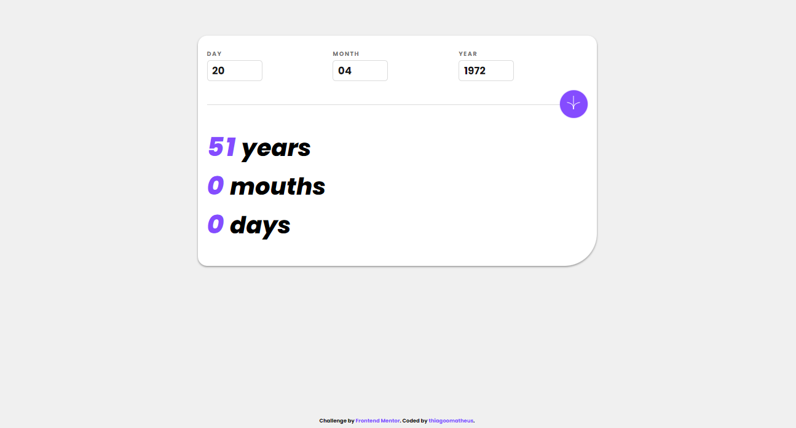

# Frontend Mentor - Age calculator app solution

This is a solution to the [Age calculator app challenge on Frontend Mentor](https://www.frontendmentor.io/challenges/age-calculator-app-dF9DFFpj-Q). Frontend Mentor challenges help you improve your coding skills by building realistic projects. 

## Table of contents

- [Overview](#overview)
  - [The challenge](#the-challenge)
  - [Screenshot](#screenshot)
  - [Links](#links)
- [My process](#my-process)
  - [Built with](#built-with)
  - [What I learned](#what-i-learned)
  - [Continued development](#continued-development)
- [Author](#author)

**Note: Delete this note and update the table of contents based on what sections you keep.**

## Overview

### The challenge

Users should be able to:

- View an age in years, months, and days after submitting a valid date through the form
- Receive validation errors if:
  - Any field is empty when the form is submitted
  - The day number is not between 1-31
  - The month number is not between 1-12
  - The year is in the future
  - The date is invalid e.g. 31/04/1991 (there are 30 days in April)
- View the optimal layout for the interface depending on their device's screen size
- See hover and focus states for all interactive elements on the page

### Screenshot

### Links

- Solution Code: [GitHub](https://github.com/thiagoomatheus/age-calculator-app-main)
- Live Site URL: [GitHub Pages](https://thiagoomatheus.github.io/age-calculator-app-main/index.html)

## My process

### Built with

- Semantic HTML5 markup
- CSS custom properties
- Flexbox
- CSS Grid
- Mobile-first workflow
- JS

### What I learned

In this project I was able to develop skills with manipulating dates in Javascript, in addition to working with data validation and error handling.

The project requires dates to be checked against the maximum number of days, months and years. Thus, the validation included the use of the Date object, conditional structures, and DOM manipulation.

### Continued development

Although the script is functional it can still be made cleaner. Thus, I intend to make changes to the code to make it cleaner and following good practice standards.

Code refactoring will have a positive impact, making the code lighter and more readable, in addition to facilitating future maintenance.

## Author

- GitHub - [Thiago Oliveira Matheus](https://github.com/thiagoomatheus)
- Frontend Mentor - [@thiagoomatheus](https://www.frontendmentor.io/profile/thiagoomatheus)
